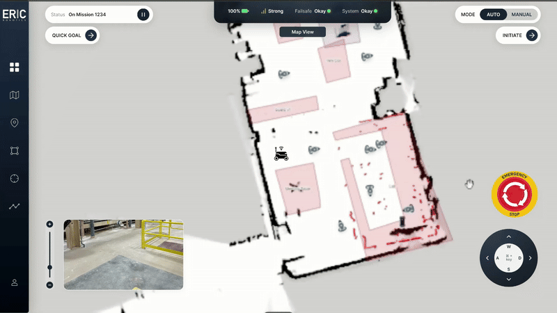

# Insight.IO — Robot Mission-Control Dashboard

A self-hosted recreation of ERIC Robotics' **Insight.IO** dashboard, built for the
Full Stack Developer assignment. It reproduces the layout, components and
interactions from the reference demo: a swappable **3D map view** (rendered from a
`.pcd` point cloud) and **camera feed**, live telemetry, drive-mode switching and
on-screen / keyboard teleop — all running from a local dev server with no runtime
internet dependency.

---

## 👤 Candidate details

| | |
|---|---|
| **Full Name** | Arbaz Ali |
| **Contact Number** | +91 6287338719 |
| **Email ID** | arbazalisgl@gmail.com |
| **GitHub Username** | Arbaz001 |

---

## ✨ Features

- **Swappable dual view** — the 3D map and the camera feed occupy the main stage
  and a picture-in-picture tile. Click the PiP (or its hover prompt "Click to
  enter … view") to swap them; the centre label updates between **Map View** and
  **Camera View**. Both streams stay mounted during a swap, so the point cloud is
  never reloaded and the video never restarts.
- **3D Map View (point cloud)** — a real `.pcd` file loaded with three.js'
  `PCDLoader`, coloured by height like a LiDAR occupancy map, with orbit / pan and
  a zoom slider. The robot avatar is composited into the scene.
- **Camera View** — a looping local MP4 dressed with a HUD (camera id, REC
  indicator, reticle). Swapping the source for a live MJPEG/WebRTC stream is a
  one-line change.
- **Teleop** — drive the robot with **WASD / arrow keys** or the on-screen
  joystick. Both share the exact same state, so mouse and keyboard are
  interchangeable. Teleop only unlocks in **MANUAL** mode.
- **Live telemetry** — battery, signal, failsafe and system status update in the
  top bar (simulated; see [Swapping in real data](#-swapping-in-real-robot-data)).
- **Mission controls** — pause/resume, AUTO/MANUAL toggle, Quick Goal / Initiate
  actions, and a latching **Emergency Stop** that freezes the robot and raises a
  full-frame alarm.
- **Responsive & offline** — scales from laptop to large displays; after
  `npm install` it needs no network access.

---

## 🖼️ Preview

The reference design this implements:



> _Add your own screenshot / screen recording of the running app to `docs/` and
> link it here before submitting (the assignment asks for a sample image/video)._

---

## 🧱 Tech stack & why

| Choice | Reason |
|---|---|
| **React 19 + TypeScript** | Component model maps cleanly to the dashboard's discrete widgets; types keep the shared state honest. |
| **Vite** | Instant local dev server (`npm run dev`) and a static production build — exactly the "self-hosting" the brief asks for. |
| **three.js + @react-three/fiber + drei** | Industry-standard WebGL stack. `PCDLoader` reads the `.pcd` map directly; `OrbitControls` gives real 3D navigation. |
| **Zustand** | Tiny, hook-based global store. One source of truth keeps the joystick, keyboard, top bar and 3D scene in sync without prop-drilling. |
| **Tailwind CSS v4** | Fast, consistent styling with design tokens (`src/index.css`) sampled from the reference. |

No web fonts or CDN assets are used, so the app is fully self-contained.

---

## 🚀 Getting started

### Prerequisites
- **Node.js ≥ 18** (developed on Node 24) and npm.

### Install & run

```bash
# 1. Install dependencies
npm install

# 2. Start the local dev server (http://localhost:5173)
npm run dev
```

Open the printed URL in a modern browser (Chrome/Edge/Firefox/Safari).

### Production build & preview

```bash
npm run build     # type-check + bundle into dist/
npm run preview   # serve the built app locally
```

The `dist/` folder is a static bundle — you can host it with any static server
(`npx serve dist`, `python3 -m http.server`, nginx, etc.).

---

## 🎮 Controls

| Action | How |
|---|---|
| Swap map ↔ camera | Click the picture-in-picture tile (bottom-left) |
| Drive (MANUAL only) | `W`/`A`/`S`/`D` or arrow keys, or the on-screen joystick |
| Switch drive mode | **MODE** toggle (AUTO / MANUAL), top-right |
| Zoom the map | Vertical slider (left) or `+` / `−` buttons |
| Orbit / pan the map | Drag on the 3D view |
| Pause / resume mission | Pause button in the Status pill |
| Emergency stop | Red mushroom button (right); click again to release |

---

## 🗂️ Project structure

```
insight-io-dashboard/
├── public/
│   └── data/
│       ├── warehouse_map.pcd   # point cloud for the 3D map
│       └── camera-feed.mp4     # video for the camera feed
├── scripts/
│   └── generate_pcd.py         # reproducibly generates warehouse_map.pcd
├── src/
│   ├── App.tsx                 # layout shell (sidebar + stage + overlays)
│   ├── lib/
│   │   ├── store.ts            # Zustand store — all shared state
│   │   └── types.ts
│   ├── hooks/
│   │   ├── useKeyboardDrive.ts # global WASD / arrow teleop
│   │   └── useTelemetrySim.ts  # simulated telemetry stream
│   └── components/
│       ├── icons.tsx           # inline SVG icon set (no icon font)
│       ├── layout/             # Sidebar, TopBar
│       ├── views/              # MapView (PCD), CameraView, Stage, RobotMarker
│       └── controls/           # Joystick, EmergencyStop, ZoomSlider, ModeToggle…
└── ...
```

The design is deliberately **modular**: each widget is a small, single-purpose
component, and every cross-widget interaction flows through the one Zustand store,
which keeps the components themselves free of wiring.

---

## 🧩 Data assets

- **`warehouse_map.pcd`** — a synthetic warehouse LiDAR scan (~68k points)
  generated by [`scripts/generate_pcd.py`](scripts/generate_pcd.py). It is a
  standard ASCII PCD file, so `PCDLoader` parses it exactly as it would a real
  scan. Regenerate or tweak it with:
  ```bash
  python3 scripts/generate_pcd.py
  ```
  To use a real dataset instead (e.g. KITTI), drop a `.pcd` into `public/data/`
  and point `MAP_URL` in `src/components/views/MapView.tsx` at it.
- **`camera-feed.mp4`** — a short Creative Commons clip (Big Buck Bunny) standing
  in for a live camera. Replace it with any MP4, or swap the `src` in
  `CameraView.tsx` for an MJPEG/WebRTC stream.

---

## 🤖 Swapping in real robot data

The UI is decoupled from its data sources, so wiring it to a live robot is
localised:

- **Telemetry** — replace `useTelemetrySim` with a WebSocket / **roslibjs**
  subscription that calls `setTelemetry(...)`.
- **3D map** — subscribe to a ROS point-cloud / occupancy-grid topic (via
  `roslibjs` + `rosbridge`, or **ros3djs**) and feed the geometry into
  `PointCloud`, or play a bag file.
- **Camera** — point `CameraView` at the robot's video stream.
- **Teleop** — publish the store's drive state to a `/cmd_vel` topic.

---

## 🎨 Design decisions

- **Single WebGL context + single `<video>`, repositioned on swap** — avoids
  reloading heavy assets and prevents dual-context overhead.
- **Store-driven interactions** — keyboard and joystick write the same drive
  flags; a `canDrive()` guard (MANUAL, not paused, not e-stopped) is the single
  gate for motion, so the robot can never get "stuck" driving.
- **Per-frame motion outside React** — the robot integrates its pose in
  `useFrame` and mutates the mesh directly, keeping teleop smooth without
  re-rendering the tree every frame.
- **Height-coloured point cloud** — mirrors how LiDAR maps are conventionally
  visualised and matches the pink-obstacle look of the reference.

---

## 📄 Credits

- Reference design & assignment: **ERIC Robotics**.
- Sample video: *Big Buck Bunny* © Blender Foundation (CC BY 3.0).
- Built with React, three.js, @react-three/fiber, drei, Zustand and Tailwind CSS.
